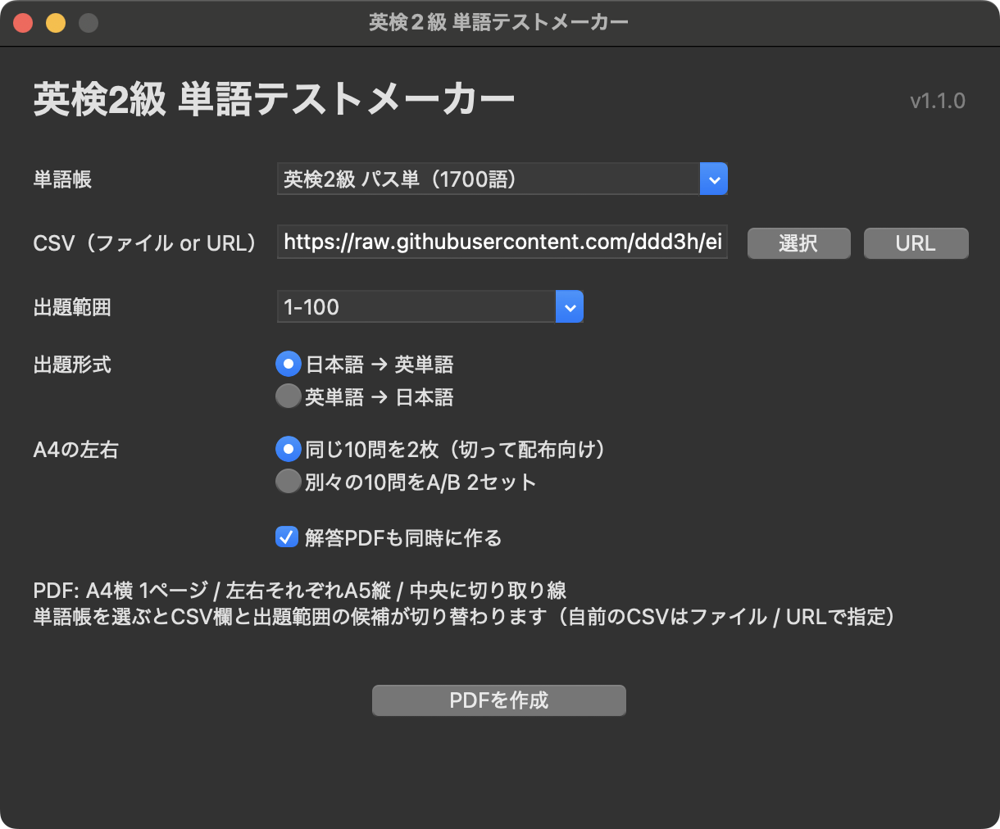

# 英検2級 単語テストメーカー

CSV（`No,単語,意味`）から出題範囲を指定し、A4横1枚にA5縦の単語テストを2枚面付けして
PDFで書き出すツールです（GUI / CLI）。同一問題2枚 or 左右で別問題、解答PDFも作れます。

単語帳は同梱の **英検2級 パス単（1700語）** / **ターゲット1900（1900語）** から選べるほか、
自前のCSV（ファイル / URL）も使えます。

出力イメージ（A4横1枚に、A5縦のテストが左右2枚。中央の点線で切り取り）:

| テスト（配布用） | 解答 |
|---|---|
|  |  |

サンプルPDFそのもの: [`samples/sample_test_1-100.pdf`](samples/sample_test_1-100.pdf) /
[`samples/sample_test_1-100_answers.pdf`](samples/sample_test_1-100_answers.pdf)

## ダウンロード（ビルド済みアプリ）

[Releases](../../releases/latest) から、Windows / macOS / Linux 用のビルド済みアプリを
ダウンロードできます。Pythonのインストールは不要です。

| OS | ファイル |
|---|---|
| Windows | `EikenVocabTestMaker-Windows.zip` を解凍し `EikenVocabTestMaker.exe` を実行 |
| macOS | `EikenVocabTestMaker-macOS.zip` を解凍し `EikenVocabTestMaker.app` を実行 |
| Linux | `EikenVocabTestMaker-Linux.tar.gz` を展開し `EikenVocabTestMaker` を実行 |

※ 署名なしビルドのため、初回起動時にOSの警告が出ることがあります
（macOS: control + クリック →「開く」/ Windows: 「詳細情報」→「実行」）。

### 新しいバージョンのお知らせ

GUIを起動すると、バックグラウンドで [Releases](../../releases/latest) の最新版を確認し、
今より新しいバージョンがあれば画面下に「新しいバージョン vX.Y.Z があります」と表示します。
クリックするとダウンロードページが開きます（アプリが勝手に自分を書き換えることはありません）。

- オフラインでも普通に使えます（確認に失敗しても何も表示しません）
- 確認したくない場合は `--no-update-check` を付けて起動します
- CLIから確認するだけなら `python3 vocab_test_maker.py --check-update`

## いちばん簡単な使い方（ソースから・Mac）

1. このリポジトリをダウンロード（Code → Download ZIP）して展開します。
2. `run_mac.command` をダブルクリックします。
3. 初回だけ必要なPythonパッケージが自動で入ります（要インターネット接続）。
4. GUIで出題範囲を選び、「PDFを作成」を押します。

※ macOSのセキュリティで初回起動を止められた場合:
Finderで `run_mac.command` を control + クリック →「開く」

## 単語帳を選ぶ

同梱の単語帳は `data/` にCSVとして置いてあり、アプリはそれを **GitHubのRaw URL** から
毎回ダウンロードして使います（手元にCSVを置く必要はありません）。

| 単語帳 | `--dataset` | 語数 | CSV |
|---|---|---|---|
| 英検2級 パス単（既定） | `eiken2` | 1700 | [`data/eiken2_pass_tan_1700.csv`](data/eiken2_pass_tan_1700.csv) |
| ターゲット1900 | `target1900` | 1900 | [`data/target_1900.csv`](data/target_1900.csv) |

- GUI: 「単語帳」プルダウンで選ぶと、CSV欄のURLと出題範囲の候補（1-100, 101-200, …）が自動で切り替わります。
  「カスタム」を選ぶ（または CSV欄を直接書き換える）と自前のCSVを使えます。
- CLI: `--dataset target1900` のように指定します（省略時は `eiken2`）。`--csv` と同時には指定できません。

```bash
python3 vocab_test_maker.py --dataset target1900 --range 1801-1900 --output test.pdf
```

## 自前のCSVをファイルパスやURLで指定する

同梱の単語帳以外を使いたいときは、GUIのCSV欄・CLIの `--csv` に、ローカルのファイルパスか
**URL** を指定します。URLの場合は起動のたびにダウンロードして使うので、CSVファイルを事前に
ダウンロードしておく必要がありません（ローカルにはキャッシュしません）。

- 対応: `http://` / `https://` のURL
- GitHubの通常のファイル表示URL（`.../blob/...`）を渡した場合は、自動的にRaw URLに変換します
- GUIでは「URL」ボタンから入力できます

```bash
python3 vocab_test_maker.py --range 1-100 \
  --csv https://raw.githubusercontent.com/ddd3h/eiken-vocab-test-maker/main/data/eiken2_pass_tan_1700.csv \
  --output test.pdf
```

## CLI例

```bash
python3 vocab_test_maker.py --range 1-100 --output test.pdf
python3 vocab_test_maker.py --range 101-200 --direction word-to-meaning \
  --two-sets different --answers --output test_101_200.pdf

# 同じ問題を再現したい場合
python3 vocab_test_maker.py --range 1-100 --seed 12345 --output test.pdf
```

主なオプション:

| オプション | 説明 |
|---|---|
| `--dataset` | 同梱の単語帳: `eiken2`（英検2級 パス単, 既定）/ `target1900`（ターゲット1900） |
| `--csv` | 自前のCSVファイルのパス、またはURL（`--dataset` の代わりに使う） |
| `--range` | 出題範囲。例: `1-100` |
| `--direction` | `meaning-to-word`（日本語→英単語）/ `word-to-meaning`（英単語→日本語） |
| `--two-sets` | `same`（左右とも同じ10問）/ `different`（左右で別の10問） |
| `--answers` / `--no-answers` | 解答PDFを作る / 作らない |
| `--seed` | 乱数seed（同じ問題を再現したい場合） |
| `--output` | 出力PDFのパス |
| `--gui` | GUIを起動 |
| `--no-update-check` | GUI起動時に新バージョンの確認をしない |
| `--check-update` | 新しいバージョンがあるか確認して終了 |
| `--version` | バージョンを表示 |

## GUIの機能



- 単語帳: 英検2級 パス単（1700語）/ ターゲット1900（1900語）/ カスタム（自前のCSV）
- 出題範囲: 1-100, 101-200, ... （単語帳の語数に合わせて候補を生成。自由入力も可）
- 100語の範囲からランダムに10問
- 日本語 → 英単語 / 英単語 → 日本語
- A4横1ページにA5縦を左右2枚
- 「同じ10問を2枚」または「A/B別々の10問」
- 解答PDFも同時生成可能
- 自前のCSVはファイル選択またはURL指定
- 新しいバージョンがあれば画面下にお知らせ（クリックでダウンロードページ）

## CSVフォーマット

列名は `No,単語,意味` の3列（UTF-8）である必要があります（`No.` のようにドット付きでも可）。

```csv
No,単語,意味
1,let,Oに～させる
2,create,(を)つくり出す
```

この形式のCSVを用意して「カスタム」で指定すれば、英検2級やターゲット1900に限らず
汎用の単語テストメーカーとして使えます。

## リリース手順（開発者向け）

1. `vocab_test_maker.py` の `APP_VERSION` を上げる（例: `"1.2.0"`）
2. 同じ番号でタグを打って push する: `git tag v1.2.0 && git push origin v1.2.0`
3. GitHub Actions が各OS向けにビルドし、Releases に添付します

タグと `APP_VERSION` が食い違っているとビルドが失敗します（配布済みアプリの更新通知は
Releases のタグ名を見ているため）。

## .app（macOSアプリ）化

`build_mac_app.command` をMacでダブルクリックすると、PyInstallerで
`dist/EikenVocabTestMaker.app` を作ります。macOS用の実行バイナリ/.appは、
macOS上でビルドする必要があります。

## 必要環境

- macOS
- Python 3
- インターネット接続（初回の依存パッケージインストール時、CSVをURLで指定する場合、新バージョンの確認）

## ライセンス

[MIT License](LICENSE)
